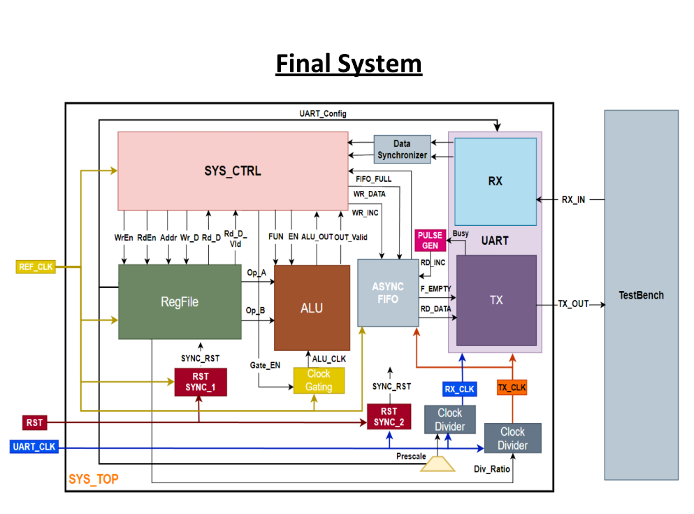

# RTL-to-GDSII Implementation of a Low-Power Configurable Multi-Clock Digital System

This project implements a digital system from **RTL to GDSII** using a full **ASIC design flow**. The design includes multiple clock domains, low-power techniques like clock gating, and formal verification.

---

## 🛠️ Project Overview

This design interfaces via **UART** to receive commands that either:
- Access a register file
- Execute ALU operations

It uses multiple clock domains to optimize performance and power, and transmits results (with CRC protection) via FIFO and UART TX.

---

## 📂 RTL Folder Structure

The `RTL/` directory contains module-specific subdirectories:

- **ALU/** – Arithmetic & logic operations (add, sub, AND, OR, shift)
- **RegFile/** – Register file for operand storage and access
- **UART/** – UART TX and RX logic
- **Clock_Divider/** – Generates additional clocks from a master source
- **Clock_Gating/** – Dynamically disables clocks to save power
- **BIT_SYNC/** / **DATA_SYNC/** / **RST_SYNC/** – Synchronizers for safe signal transfer between clock domains
- **SYS_CTRL/** – FSM control unit for system coordination
- **Top/** – Top-level module that integrates all blocks

---

## 🧪 Testbench (`TB/`)

Contains simulation testbenches written in Verilog to verify:
- UART communication
- Clock-domain behavior
- ALU and register functionality

---

## 🗄️ Backend (`Backend/`)

ASIC implementation files including:
- **synthesis/** – Synthesis TCL scripts
- **DFT/** – DFT (Scan insertion) files
- **formality/** – Setup for RTL vs Gate-Level formal verification

---

## 🖼️ System Diagram



---

## ▶️ Simulation Instructions

To run the RTL simulation:

1. Clone the project:
   ```bash
   git clone https://github.com/Sara2mahmoud/RTL-to-GDS-Implementation-of-Low-Power-Configurable-Multi-Clock-Digital-System.git
   cd RTL-to-GDS-Implementation-of-Low-Power-Configurable-Multi-Clock-Digital-System
   ```

2. Open **ModelSim** or **QuestaSim** GUI.

3. Load the project directory, then run:
   ```tcl
   do run.do
   ```

This will compile and simulate the RTL design with waveform viewing enabled.

---

## 🧑‍💻 Author

- Sara Mahmoud — [@Sara2mahmoud](https://github.com/Sara2mahmoud)

## 📜 License

For academic and non-commercial use only.
